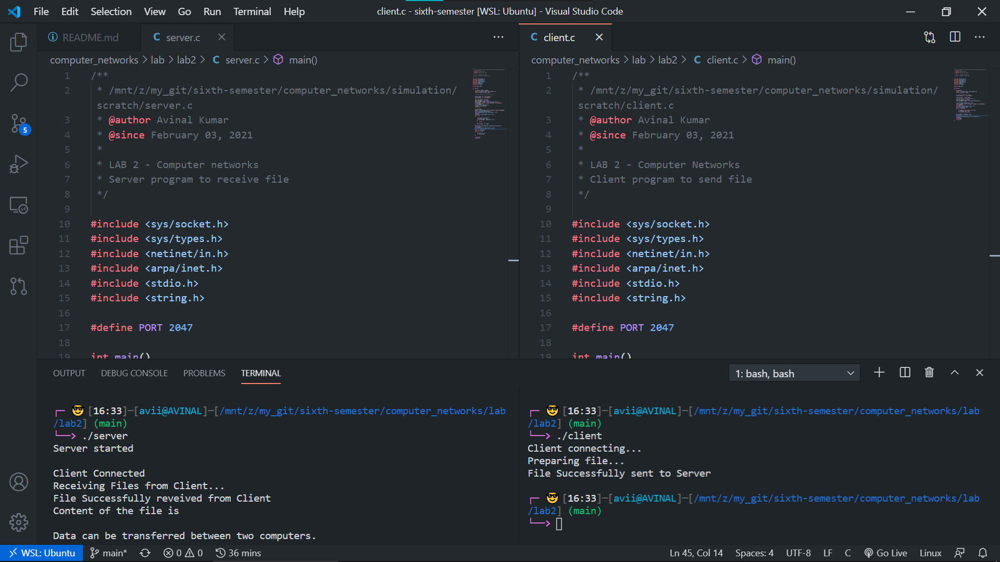

# LAB 2 - Computer Networks 

## Files

| File Name | Description |
| --- | --- |
| [client.c](client.c) | client implementation |
| [server.c](server.c) | server implementation |
| [client.txt](client.txt) | File to be sent |
| [server.txt](server.txt) | Received File |

## Background

Socket Program to transfer file from server to client. The Client
will request the file(server.txt) from the server and the server
responds back to client with the requested file.

Run Program as `./client` and `./server`
where, client is the client executable socket and server.txt is
the name of the file in the server.

## Questions

1. Assisgnment: As part of the class assignment, write a
client-server socket program to upload the file from client
machine to the server machine.

## Output

## Student Details

- Name: Avinal Kumar
- Roll: 185067
- Branch: CSE
- Date: 03 Feb 2021
