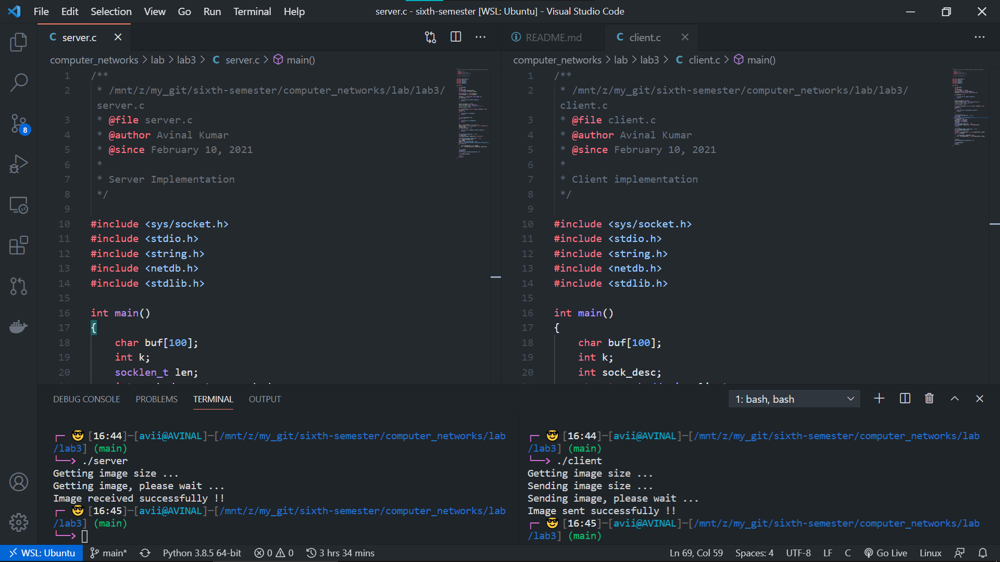

# LAB 3 - Computer Networks 

## Files

| File Name | Description |
| --- | --- |
| [client.c](client.c) | client implementation |
| [server.c](server.c) | server implementation |
| [SocialMedia.jpg](SocialMedia.jpg) | Image file to be sent |
| [received.jpg](received.jpg) | Image file to be received |

## Background

**These socket programs create a client – server chat application
between the server and the client for exchange of text messages.**

## Question(s)
1. As part of the assignment, modify the Client and Server Codes
so that an image file (“SocialMedia.jpg” attached with the assignment) can be
transferred from the Client to the Server machine.

## Output

## Student Details

- Name: Avinal Kumar
- Roll: 185067
- Branch: CSE
- Date: 10 Feb 2021
