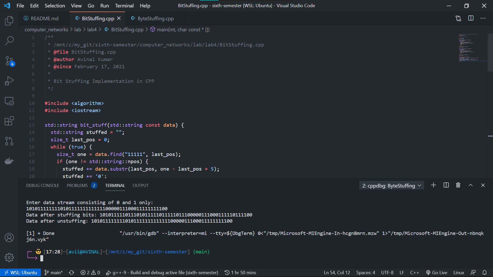

# LAB 4 - Computer Networks 

## Files

| File Name | Description |
| --- | --- |
| [BitStuffing.c](BitStuffing.c) | Bit Stuffing implementation |
| [ByteStuffing.c](ByteStuffing.c) | Byte Stuffing implementation |
| [BitStuffing.png](BitStuffing.png) | Bit Stuffing output |
| [ByteStuffing.png](ByteStuffing.png) | Byte Stuffing Output |

## Question(s)
1. Write a C or C++ program to perform bit stuffing on the following data stream at the sender end and then perform the bit unstuffing at the receiver end to retrieve the original data.

    Data stream: **10101111111101011111111111110000011100011111111100**

2. Write a C or C++ program to perform the byte stuffing and unstuffing of the following data stream represented in Hexadecimal form. The hexadecimal code for the flag and escape are *0x7F* *0x5D* (here 0x means that the data is represented in hexadecimal form). Note that the flag and escape code appearing within the data frame have to be escaped using the escape code.

    Hexadecimal data stream: 0x6A912EEF**7F**12**5D**B21**7F**1A8**5D**12F
    (Flag and ESC code are highlighted)

## Output

|Bit Stuffing | Byte Stuffing |
| --- | --- |
|  |  |

## Student Details

- Name: Avinal Kumar
- Roll: 185067
- Branch: CSE
- Date: 17 Feb 2021
