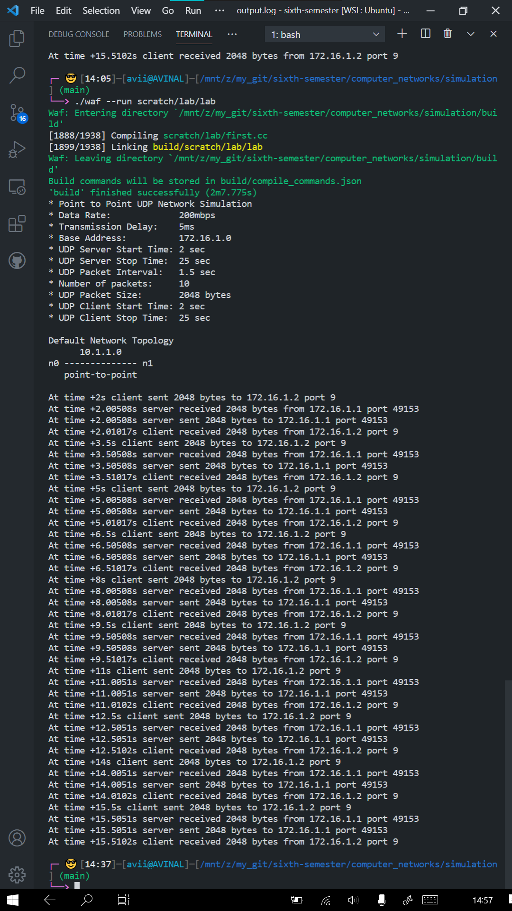

# LAB 6 - Computer Networks 

## Files

| File Name | Description |
| --- | --- |
| [first.cc](first.cc) | Point to Point UDP Network Simulation |
| [output.log](output.log) | Simulation Output |
| [point-to-point.png](point-to-point.png) | Simulation Output Image |

## Question(s)
Peform the following modifications on the first.cc ns3 script: 
1. Set the Data rate of the point to point channel to 200Mbps 
2. Set the Transmission Delay of the channel to 5ms 
3. Change the base address of the point to point network to 172.16.1.0 
4. Start the UDP server at 2 seconds into the start of the simulation 
5. Stop the UDP server after 25 seconds into the simulation 
6. Set the UDP packets interval from client to server as 1.5 sec. 
7. Set the number of packets transmitted from client to server equal to 10 
8. Set the UDP packet size sent from client to server as 2048 bytes. 
9. Start the UDP client at 2 seconds into the start of the simulation 
10. Stop the UDP client after 25 seconds into the simulation 

## Output

## Student Details

- Name: Avinal Kumar
- Roll: 185067
- Branch: CSE
- Date: 26 March 2021
