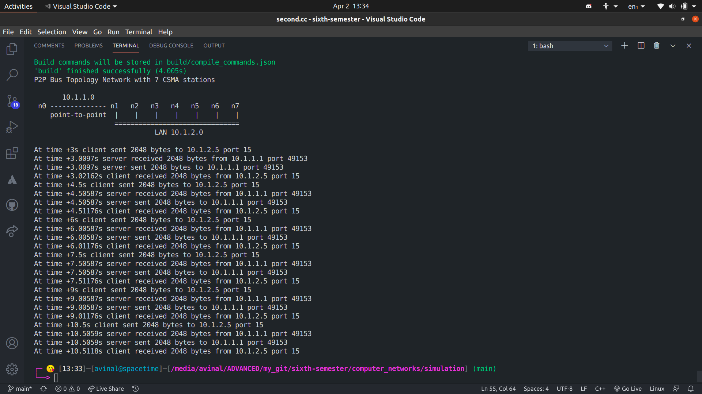
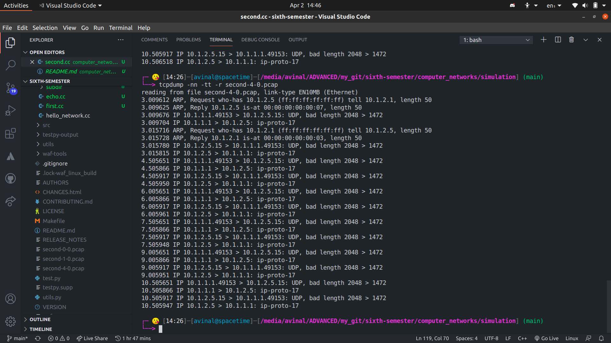

# LAB 7 - Computer Networks 

## Files

| File Name | Description |
| --- | --- |
| [second.cc](second.cc) | Point to Point UDP Network Simulation |
| `second-*-0.pcap` | Packet Captured  in promiscuous mode|
| [csma-p2p.png](csma-p2p.png) | Simulation Output Image |
| [macaddr.png](macaddr.png)| Mac address of 3rd device |

## Question(s)
Peform the following modifications on the second.cc ns3 script: 
1. Increase the number of stations in the CSMA LAN network to 7 nodes. 
2. Set the datarate of the point to point link to 20 Mbps with a delay of 5ms. 
3. Set the datarate of the CSMA network to 300 Mbps with a delay of 10,000 nanoseconds 
4. Make the 4th node in the CSMA network as the UDP Echoserver listening at port 15. 
5. Start the UDP server at 2.0 seconds and stop it at 12 seconds. 
6. Set the Max number of packets, Packet interval time and packet size of the UDP client running at the leftmost node of the point to point link to 6, 1.5 seconds and 2048 bytes respectively. 
7. Set the 3rd device on the CSMA network to capture the packets in a promiscuous mode. 
8. Start the UDP client at 3.0 seconds and stop it at 14 seconds. 
9. Determine the MAC address of the UDP server by reading the pcap file captured at the 3rd device on the CSMA network.
 

## How to run this simulation?
- You must have a working installation of [ns3](https://www.nsnam.org/)
- Copy [second.cc](second.cc) to `scratch` directory.
- Run `./waf --run scratch/second`

## Output

**MAC Address of UDP Server: `00:00:00:00:00:07`**

## Student Details

- Name: Avinal Kumar
- Roll: 185067
- Branch: CSE
- Date: 2 April 2021
