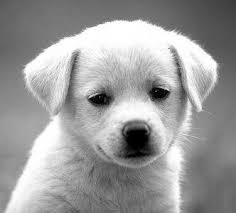
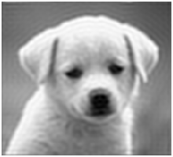
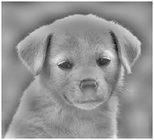

# Digital Image Processing - LAB 2

## Question
Implement i) Low Pass Filter, ii) High Pass Filter

## Output

| Original Image | Low Pass Filter | High Pass Filter |
| --- | --- | --- |
|  |  |  |